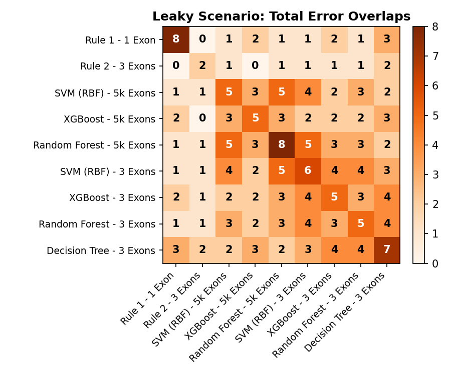
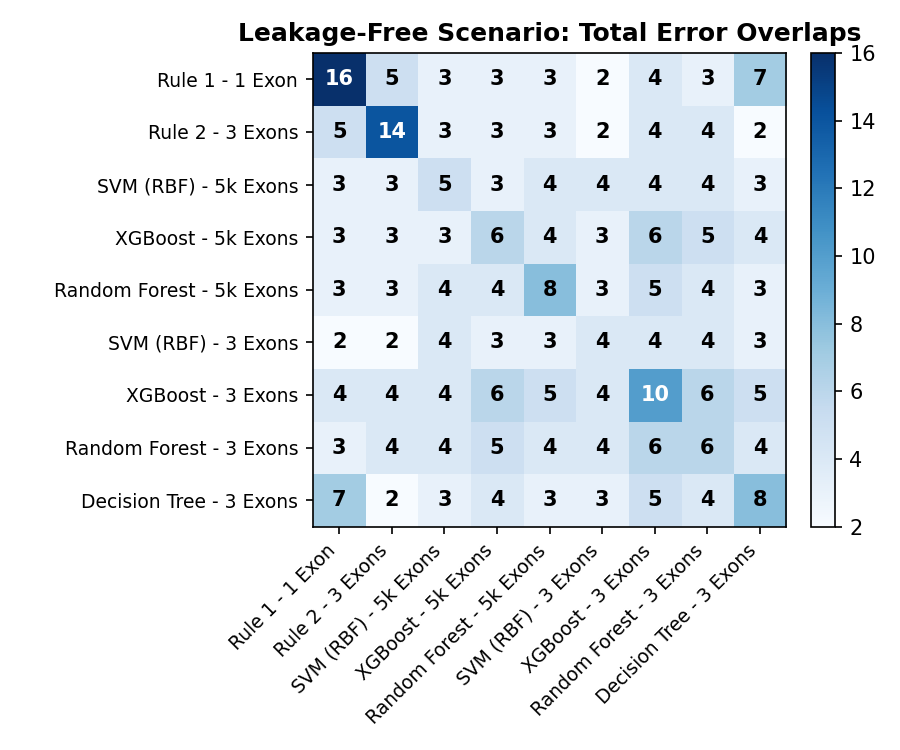
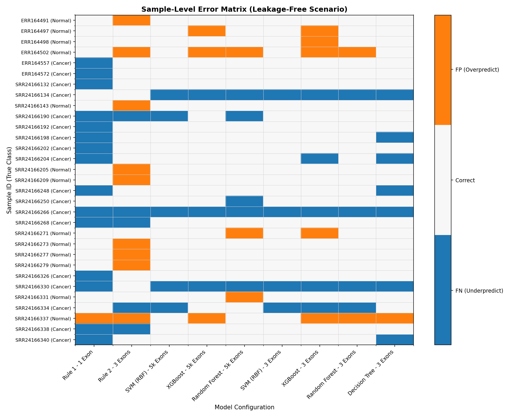

# Complete Error Analysis: Rule-Based vs. Machine Learning Models

This report provides the complete error analysis comparing the **Rule-Based Heuristic Classifiers** and **Machine Learning Models** (SVM, XGBoost, Random Forest, Decision Tree) under two validation scenarios:
1. **Scenario A (Leaky CV)**: ComBat batch correction was applied globally before Leave-One-Out Cross-Validation (LOO-CV).
2. **Scenario B (Leakage-Free CV)**: ComBat batch correction was fit strictly inside the LOO-CV loop.

Both scenarios evaluate models using **all 5,000 exons** and **only the 3 key exons** used by the rules:
- Exon 1: `ENSG00000164266_620977`
- Exon 2: `ENSG00000019169_316124`
- Exon 3: `ENSG00000204305_741180`

---

## 📊 Comprehensive Performance Metrics Table

The models were evaluated on the aligned dataset of **103 samples** (56 Cancer, 47 Normal).

| Model Configuration | Leaky CV Accuracy | Leaky Sensitivity | Leaky Specificity | Leaky Errors | Leak-Free CV Accuracy | Leak-Free Sensitivity | Leak-Free Specificity | Leak-Free Errors |
| :--- | :---: | :---: | :---: | :---: | :---: | :---: | :---: | :---: |
| **Rule 1 (1 Exon)** | 92.16% | 89.29% | 95.65% | 8 | 84.47% | 73.21% | **97.87%** | 16 |
| **Rule 2 (3 Exons)** | **98.04%** | **98.21%** | 97.83% | **2** | 86.41% | 91.07% | 80.85% | 14 |
| **SVM (RBF) - 5k Exons** | 95.10% | 91.07% | **100.00%** | 5 | 95.15% | 91.07% | **100.00%** | 5 |
| **XGBoost - 5k Exons** | 95.10% | 94.64% | 95.65% | 5 | 94.17% | 94.64% | 93.62% | 6 |
| **Random Forest - 5k Exons** | 92.16% | 91.07% | 93.48% | 8 | 92.23% | 91.07% | 93.62% | 8 |
| 🌟 **SVM (RBF) - 3 Exons** | 94.12% | 92.86% | 95.65% | 6 | **96.12%** | 92.86% | **100.00%** | **4** |
| **XGBoost - 3 Exons** | 95.10% | **96.43%** | 93.48% | 5 | 90.29% | 91.07% | 89.36% | 10 |
| **Random Forest - 3 Exons** | 95.10% | 94.64% | 95.65% | 5 | 94.17% | 92.86% | 95.74% | 6 |
| **Decision Tree - 3 Exons** | 93.14% | 94.64% | 91.30% | 7 | 92.23% | 87.50% | **97.87%** | 8 |

---

## 🎨 Error Overlap Visualizations

### 🔄 Scenario A (Leaky CV) vs. Scenario B (Leakage-Free CV) Error Overlap Heatmaps
The heatmaps show the count of total shared errors between model configurations in both scenarios.

#### Leaky Scenario (Global ComBat) Total Error Overlaps:

#### Leakage-Free Scenario (ComBat Inside Loop) Total Error Overlaps:

---

### 🗺️ Sample-Level Error Matrix (Leakage-Free Scenario)
This matrix details the exact sample IDs misclassified by each configuration in the leakage-free scenario, indicating False Positives (FP in orange) and False Negatives (FN in blue).

---

## 🔑 Crucial Scientific Insights

### 1. The Root Cause of Data Leakage (สาเหตุของ Data Leakage)
In the original preprocessing pipeline, **ComBat batch correction was run globally on the entire dataset** before splitting it for Leave-One-Out Cross-Validation (LOO-CV).
* **The Mechanism of Leakage (กลไกการรั่วไหล)**: ComBat estimates batch adjustment parameters (mean and variance of each batch) by looking at **all samples** in that batch simultaneously. When run globally, the corrected features of the test sample $X_{te}$ are adjusted using statistics that contain information from the training samples, and vice versa. This is a form of **distributional data leakage**.
* **Threshold Overfitting (การฟิตของ Threshold กับข้อมูลรั่ว)**: The hardcoded thresholds of Rule 2 (`<= 2.75`, `<= 2.71`, `<= 5.77`) were hand-tuned on these globally ComBat-corrected features. Because these thresholds were custom-tailored to the specific coordinate alignment produced by the global ComBat run, they were highly overfitted to this leaked batch alignment.
* **The Correction (เมื่อตัด Leakage ออก)**: In the **Leakage-Free (Scenario B)** pipeline, ComBat is fit *strictly* on the 102 training samples in each fold, and the fitted parameters are then used to transform the 1 test sample. When ComBat is run properly inside the loop, the batch alignment offsets shift slightly from fold to fold. This causes the rigid, hardcoded thresholds of Rule 2 to fail for samples near the boundary, collapsing its accuracy from **98.04%** to **86.41%**.

### 2. Why the Machine Learning Models Remained Stable
* **Dynamic Decision Boundary (ขอบเขตการตัดสินใจแบบไดนามิก)**: Unlike Rule 2, which uses rigid thresholds, the ML models (SVM, XGBoost, Random Forest) do not hardcode any numbers. In each fold, they receive the ComBat-corrected training set and dynamically calculate the optimal decision boundary.
* **Generalizability (ความสามารถในการสรุปผล)**: If ComBat shifts the feature scales slightly from fold to fold, the ML model automatically adapts its internal weights and thresholds during training, ensuring high generalization accuracy (**95.15% for SVM on 5k Exons**).

### 3. The Victory of ML on the 3-Exon Subset (SVM RBF)
* **SVM (RBF) restricted to the 3 key exons** achieved the highest leakage-free accuracy of **96.12%** (only 4 errors, 100% specificity).
* By focusing only on these 3 highly informative exons, SVM avoids the curse of dimensionality and learns a smooth, non-linear decision boundary that adapts dynamically to the batch corrections.
* This proves that the feature selection of the 3 exons is highly biologically sound, but we must use a **dynamic ML classifier** (like SVM) rather than a rigid, hardcoded rule.

---

## 📂 Files
All summary CSVs and full-resolution graphics are available in the workspace:
* Report Markdown: [complete_error_analysis_report.md](complete_error_analysis_report.md)
* Summary Table CSV: [complete_error_analysis_summary.csv](complete_error_analysis_summary.csv)
* Plots Directory: [results/](file:///mnt/a/data%20sci/data/counts/results/)
