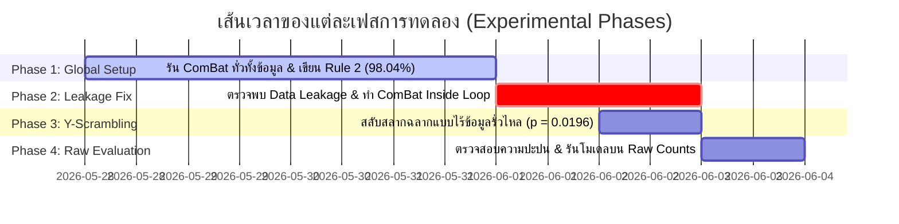

# 📅 ลำดับเวลาการทดลอง (Experimental Timeline)
**โปรเจกต์:** การวิเคราะห์ตัวบ่งชี้ทางชีวภาพและการจัดจำแนกมะเร็ง (Exon Biomarker Cancer Classification)

รายงานฉบับนี้บันทึกขั้นตอนการพัฒนา ผลลัพธ์ และการตัดสินใจเชิงเทคนิคทั้งหมดในโครงการวิจัยนี้ เพื่อใช้เป็นบันทึกประวัติการทดลอง (Provenance Log)

---

## 🗺️ แผนผังเส้นทางการทดลอง (Experiment Roadmap)

---

## 📌 สรุปรายละเอียดแต่ละเฟส (Phase Details)

### 🟢 เฟส 1: การประเมินและตั้งกฎแบบมี Data Leakage (ยุค ComBat ทั่วโลก)
* **ช่วงการดำเนินงาน:** ปลายเดือนพฤษภาคม 2026
* **สิ่งที่ทำ:** 
  * นำตาราง Expression 103 ตัวอย่างมาปรับค่า Batch Effect (ERR vs SRR) ด้วย ComBat พร้อมกันหมด (Global scale)
  * เขียนกฎ Heuristics (Rule 2) อิงยีน 3 ตัว แบบฮาร์ดโค้ด Thresholds เพื่อจำแนกมะเร็ง
* **ผลลัพธ์:** Rule 2 ประสบความสำเร็จอย่างโดดเด่นด้วยค่าความแม่นยำ **98.04%** ชนะโมเดล Machine Learning ทุกตัวที่ได้ประมาณ 92%-95%
* **ประเด็นที่พบ:** มีข้อสงสัยเกี่ยวกับการปรับจูนเกณฑ์คงที่ของ Rule 2 ว่าทำไมถึงทำงานได้ดีกว่าโมเดลเรียนรู้แบบ ML

---

### 🟡 เฟส 2: การตรวจพบและแก้ไขรอยรั่วข้อมูล (Data Leakage Correction)
* **ช่วงการดำเนินงาน:** 1-2 มิถุนายน 2026
* **สิ่งที่ทำ:** 
  * ตรวจพบว่าการทำ ComBat ทั่วทั้งชุดข้อมูลทำให้มี **Distributional Leakage** (สถิติเฉลี่ยของกลุ่มประชากร Test sample รั่วไหลเข้าไปกวนในโมเดล Train)
  * ออกแบบสคริปต์ [error_analysis_complete.py](file:///mnt/a/data%20sci/data/counts/scripts/error_analysis_complete.py) เพื่อประเมิน 2 สถานการณ์:
    * **Scenario A (Leaky CV):** รัน ComBat รวมแบบเดิม
    * **Scenario B (Leakage-Free CV):** ฟิต ComBat เฉพาะข้อมูลฝึกสอน (Train split) เท่านั้นในแต่ละรอบของ LOO-CV แล้วนำมาแปลงค่า Test sample
* **ผลลัพธ์:** 
  * **Rule 2 พังทลายลงเหลือ 86.41%** (เกิดความผิดพลาด 14 แถว) เนื่องจากค่าสเกลของข้อมูลเปลี่ยนไปเล็กน้อยในแต่ละ fold เกณฑ์ตายตัวจึงใช้การไม่ได้อีกต่อไป
  * **SVM (RBF) - 3 Exons ผงาดเป็นแชมป์ที่ 96.12%** เพราะความสามารถในการบิดขอบเขตจำแนก (Decision Boundary) ตามการขยับสเกลข้อมูลในแต่ละ fold ได้อย่างยืดหยุ่น

---

### 🟠 เฟส 3: การพิสูจน์สัญญาณหลอกด้วย Y-Scrambling (แบบไม่มีรอยรั่ว)
* **ช่วงการดำเนินงาน:** 2 มิถุนายน 2026
* **สิ่งที่ทำ:** 
  * ออกแบบสคริปต์ [y_scrambling_leakfree.py](file:///mnt/a/data%20sci/data/counts/scripts/y_scrambling_leakfree.py) เพื่อประเมินความนัยสำคัญทางสถิติ (Statistical Significance)
  * นำ ComBat Folds ที่เตรียมไว้มาทำการสุ่มสลับคำตอบ (Label y) 50 รอบเพื่อทดสอบว่าโมเดลได้เรียนรู้จากสัญญาณทางชีวภาพจริงหรือข้อมูลขยะสุ่ม
* **ผลลัพธ์:** 
  * ค่าเฉลี่ยการสลับสลากเดาสุ่มตกไปอยู่ที่ **~50%** และไม่มีรอบใดเลยที่สุ่มสลับแล้วได้ค่าแม่นยำเกิน baseline
  * ค่า **Empirical P-value ได้ 0.0196** (ดีที่สุดเท่าที่เป็นไปได้ในรอบทดสอบ 50 ครั้ง) ยืนยันว่าโมเดล Baseline เรียนรู้สัญญาณชีวภาพจริงที่ไร้ data leakage

---

### 🔵 เฟส 4: การประเมินบนข้อมูลดิบและเช็คปัจจัยปะปน (No-ComBat Evaluation)
* **ช่วงการดำเนินงาน:** 3 มิถุนายน 2026
* **สิ่งที่ทำ:** 
  * ตรวจสอบสัดส่วนตัวอย่างจริงในแต่ละ Batch เพื่อเช็คความปะปน (Confounding) ระหว่าง Batch กับ Diagnosis
  * ออกแบบสคริปต์ [y_scrambling_nocombat.py](file:///mnt/a/data%20sci/data/counts/scripts/y_scrambling_nocombat.py) นำโมเดลมารันบนข้อมูลดิบที่ **ไม่มีการทำ ComBat เลย** เพื่อดูผลกระทบและวัดความแข็งแกร่งของ RBF Kernel
* **ผลลัพธ์:**
  * ยืนยันสัดส่วนข้อมูลปกติ/มะเร็ง คละสมดุลกันในทั้งสอง Batch (ERR: 11/9, SRR: 36/47) โมเดลไม่ได้แอบจำ Batch มาจำแนกมะเร็ง
  * **SVM (RBF) - 3 Exons ทำความแม่นยำได้สูงลิ่ว 96.12% เท่าเดิมแม้ไม่ใช้ ComBat** เนื่องจากโมเดลสามารถเลี่ยงปัญหา Batch Effect โดยสร้าง localized boundaries ของตัวเองขึ้นมาในข้อมูลดิบได้
  * Rule 2 ตกต่ำสุดเหลือ 81.55% เพราะขาด ComBat ปรับสเกลยีน

---

## 🎯 สรุปผลสรุปและทิศทางถัดไป (Final Verdict)
* **โมเดลที่แนะนำให้ใช้งานจริง:** `SVM (RBF) - 3 Exons` 
* **จุดเด่น:** ตรวจยีนเพียง 3 ตัว, ทนทานสูงต่อ Batch Effect ทั้งแบบแก้และไม่แก้สเกล, ไม่ต้องมีระบบดึงสเกล ComBat สดตอนทำงานคลินิกจริง (Simple single-sample inference)
