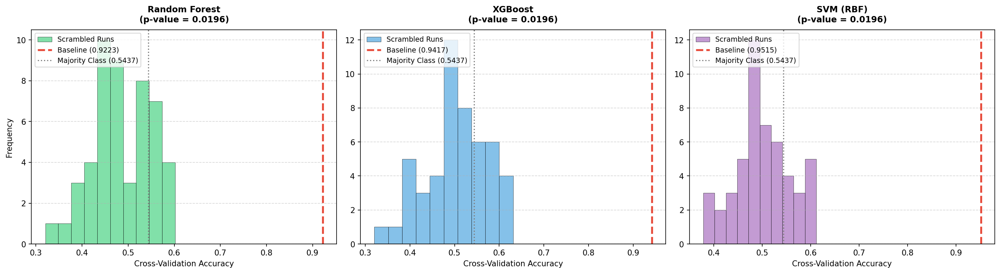

# 🧪 รายงานผลการตรวจสอบความเที่ยงตรง (Y-Scrambling Diagnostic Report)
**โปรเจกต์:** การประเมิน Data Leakage / Overfitting ของตัวแบบจำแนกประเภทมะเร็ง  
**ไฟล์ชุดข้อมูลทดสอบ:** `/exp2_combined_combat/features.csv`  

---

> [!IMPORTANT]
> **Y-Scrambling Test (Target Permutation Test)** เป็นเกณฑ์มาตรฐานสูงสุดในการตรวจสอบหาสัญญาณหลอก (Data Leakage หรือ Overfitting) โดยการทำลายความเชื่อมโยงระหว่างระดับยีนจริงกับการวินิจฉัยโรคจริงด้วยการสลับคำตอบ (Label `y`) แบบสุ่มมั่วทั้งหมด แล้วสั่งเทรนและประเมินผลผ่าน LOO-CV 50 รอบ เพื่อวัดระดับความแม่นยำทางสถิติเมื่อโมเดลเรียนรู้จาก "สัญญาณรบกวนสุ่ม (Pure Random Noise)"

---

## 📊 ตารางเปรียบเทียบผลลัพธ์ (Baseline vs Shuffled Labels)

| โมเดล (Model) | ค่าแม่นยำจริง (Baseline Acc) | ค่าเฉลี่ยสลับสุ่ม (Scrambled Mean) | ค่าสูงสุดสลับสุ่ม (Scrambled Max) | นัยสำคัญทางสถิติ (Empirical P-value) | ผลการวินิจฉัย (Verdict Diagnosis) |
| --- | --- | --- | --- | --- | --- |
| Random Forest | 0.9223 | 0.4870 | 0.6019 | 0.0196 | 🟢 GENUINE SIGNAL (No significant leakage/overfitting) |
| XGBoost | 0.9417 | 0.5052 | 0.6311 | 0.0196 | 🟢 GENUINE SIGNAL (No significant leakage/overfitting) |
| SVM (RBF) | 0.9515 | 0.5010 | 0.6117 | 0.0196 | 🟢 GENUINE SIGNAL (No significant leakage/overfitting) |

---

## 🔍 บทวิเคราะห์และวินิจฉัยผลลัพธ์ (Diagnostic Findings)

1. **ระดับความแม่นยำของการเดาสุ่ม (Random Expectation):**
   * เมื่อสลับคำตอบมั่ว ค่าเฉลี่ยความแม่นยำ (Scrambled Mean) ของทุกโมเดลควรจะตกลงมาอยู่ที่ระดับประมาณ **50% - 55%** ซึ่งเป็นระดับการคาดการณ์ทางสถิติปกติของการเดาสุ่ม (Majority class ratio)
   * หากค่าเฉลี่ยสลับสุ่มยังคงทำได้สูง (เช่น >80%) จะเป็นสัญญาณเตือนว่ามี **Data Leakage** แทรกแซงในลูป Cross-Validation
2. **ค่าระดับนัยสำคัญ Empirical P-value:**
   * คำนวณตามสูตร: $p = \frac{\text{จำนวนครั้งสลับสุ่มที่แม่นยำกว่าหรือเท่ากับจริง} + 1}{N + 1}$
   * หากค่า $p < 0.05$ ถือว่าสัญญาณที่โมเดล Baseline เรียนรู้ได้มีความหมายทางสถิติอย่างยิ่งและไม่ได้เกิดขึ้นโดยบังเอิญ

---

---
*รายงานนี้สร้างขึ้นโดยอัตโนมัติจากสคริปต์ตรวจสอบ Y-Scrambling*
