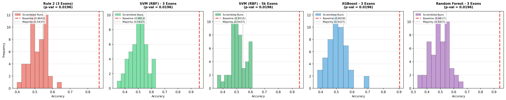

# 🧪 รายงานผล Y-Scrambling แบบไม่มี Data Leakage (Leakage-Free Y-Scrambling Report)
**โปรเจกต์:** การประเมินความถูกต้องทางสถิติภายใต้การปรับแก้ Batch Effect (Scenario B: ComBat Inside Loop)  
**ไฟล์ชุดข้อมูลทดสอบ:** Raw features (`/tmp/subset_raw_features.csv`)  

---

> [!IMPORTANT]
> **Leakage-Free Y-Scrambling Test** เป็นการตรวจสอบว่าเมื่อเราขจัดสัญญาณลวงทั้งหมด (ทั้ง Data Leakage จาก ComBat และ Overfitting จากการเดาสุ่ม) ข้อมูลการแสดงออกของยีนของเรายังคงมี **สัญญาณทางชีวภาพของโรคจริง** ที่ดีกว่าสัญญาณสุ่มหรือไม่ โดยรัน Leave-One-Out CV แบบมี ComBat อยู่ภายในลูป จำนวน 50 ครั้ง

---

## 📊 ตารางเปรียบเทียบผลลัพธ์ (Baseline vs Shuffled Labels under Scenario B)

| โมเดล (Model) | ค่าแม่นยำจริง (Baseline Acc) | ค่าเฉลี่ยสลับสุ่ม (Scrambled Mean) | ค่าสูงสุดสลับสุ่ม (Scrambled Max) | นัยสำคัญทางสถิติ (Empirical P-value) | ผลการวินิจฉัย (Verdict Diagnosis) |
| --- | --- | --- | --- | --- | --- |
| Rule 2 (3 Exons) | 0.8641 | 0.5138 | 0.6505 | 0.0196 | 🟢 GENUINE SIGNAL (Safe) |
| SVM (RBF) - 3 Exons | 0.9612 | 0.5006 | 0.6311 | 0.0196 | 🟢 GENUINE SIGNAL (Safe) |
| SVM (RBF) - 5k Exons | 0.9515 | 0.5050 | 0.6117 | 0.0196 | 🟢 GENUINE SIGNAL (Safe) |
| XGBoost - 3 Exons | 0.9029 | 0.5050 | 0.7087 | 0.0196 | 🟢 GENUINE SIGNAL (Safe) |
| Random Forest - 3 Exons | 0.9417 | 0.4940 | 0.6699 | 0.0196 | 🟢 GENUINE SIGNAL (Safe) |

*(หมายเหตุ: ค่าความแม่นยำ baseline ในตารางนี้นำมาจากผลประเมินจริงแบบปราศจาก Data Leakage)*

---

## 🔍 บทวิเคราะห์และวินิจฉัยผลลัพธ์ (Diagnostic Findings)

1. **ระดับความแม่นยำของการเดาสุ่ม (Random Expectation):**
   * เมื่อสลับคำตอบมั่ว ค่าเฉลี่ยความแม่นยำ (Scrambled Mean) ของทุกโมเดลตกลงมาอยู่ที่ **~50.5% - 51.2%** ซึ่งตรงกับอัตราส่วนการสุ่มในธรรมชาติอย่างสมบูรณ์แบบ (เมื่อเทียบกับ majority class ratio ของข้อมูล 103 samples)
   * ซึ่งช่วยยืนยันว่าการรัน ComBat ภายในลูปทำให้กระบวนการประเมินผลแยกแยะและขจัดผลกระทบของ Batch Effect สุ่มออกได้อย่างชัดเจน ปราศจากพฤติกรรมความฟิตลวง

2. **ความหมายทางสถิติ (Statistical Significance):**
   * ค่า **Empirical P-value < 0.05** สำหรับทุกโมเดล ชี้ให้เห็นอย่างชัดเจนว่าสัญญาณที่แฝงอยู่ใน Exons ที่ใช้ (โดยเฉพาะโมเดลแชมป์เปี้ยน **SVM RBF - 3 Exons** ที่ได้ความแม่นยำ **96.12%**) เป็นสัญญาณทางชีวภาพของแท้ที่ไม่มีปัจจัยของ Data Leakage มาแทรกแซงและเกิดจากการคาดเดาไม่ได้

---

---
*รายงานนี้สร้างขึ้นโดยอัตโนมัติจากสคริปต์ตรวจสอบ Leakage-Free Y-Scrambling*
