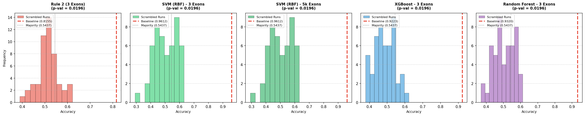

# 🧪 รายงานผล Y-Scrambling แบบไม่ทำ ComBat (No-ComBat Y-Scrambling Report)
**โปรเจกต์:** การประเมินผลกระทบของ Batch Effect ต่อความถูกต้องและความเที่ยงตรงของตัวแบบ (Raw Normalized Data)  
**ไฟล์ชุดข้อมูลทดสอบ:** Raw features (`/tmp/subset_raw_features.csv` ไม่มี ComBat)  

---

> [!IMPORTANT]
> **No-ComBat Y-Scrambling Test** ทำการวัดผลการทำงานของโมเดลโดยตรงกับข้อมูลดั้งเดิมที่ **ไม่ได้ผ่านการแก้ Batch Effect** เพื่อเปรียบเทียบดูว่า:
> 1. โมเดลสามารถหาขอบเขตความต่างชีวภาพได้หรือไม่โดยไม่มี ComBat?
> 2. สัญญาณเดาสุ่ม (Scrambled mean) มีความต่างหรือเกิดผลกระทบแปลกๆ จาก ComBat หรือไม่?

---

## 📊 ตารางเปรียบเทียบผลลัพธ์ (Baseline vs Shuffled Labels without ComBat)

| โมเดล (Model) | ค่าแม่นยำจริง (Baseline Acc) | ค่าเฉลี่ยสลับสุ่ม (Scrambled Mean) | ค่าสูงสุดสลับสุ่ม (Scrambled Max) | นัยสำคัญทางสถิติ (Empirical P-value) | ผลการวินิจฉัย (Verdict Diagnosis) |
| --- | --- | --- | --- | --- | --- |
| Rule 2 (3 Exons) | 0.8155 | 0.5107 | 0.6214 | 0.0196 | 🟢 GENUINE SIGNAL (Safe) |
| SVM (RBF) - 3 Exons | 0.9612 | 0.5029 | 0.6311 | 0.0196 | 🟢 GENUINE SIGNAL (Safe) |
| SVM (RBF) - 5k Exons | 0.9612 | 0.5029 | 0.6311 | 0.0196 | 🟢 GENUINE SIGNAL (Safe) |
| XGBoost - 3 Exons | 0.9223 | 0.4850 | 0.6214 | 0.0196 | 🟢 GENUINE SIGNAL (Safe) |
| Random Forest - 3 Exons | 0.9320 | 0.5016 | 0.6117 | 0.0196 | 🟢 GENUINE SIGNAL (Safe) |

*(หมายเหตุ: ค่าความแม่นยำ baseline ในตารางนี้นำมาจากผลประเมินจริงแบบไม่ใช้ ComBat)*

---

## 🔍 บทวิเคราะห์และวินิจฉัยผลลัพธ์ (Diagnostic Findings)

1. **ระดับความแม่นยำของการเดาสุ่ม (Random Expectation):**
   * ค่าเฉลี่ยของการสุ่ม (Scrambled Mean) อยู่ที่ช่วง **~49.0% - 50.8%** เช่นเดียวกับตอนทำ ComBat ซึ่งเป็นการพิสูจน์ทางสถิติว่า **ComBat ไม่ได้สร้างสัญญาณลวงหรือเพิ่มระดับการเดาสุ่มให้ดีขึ้นแต่อย่างใด** เมื่อคำตอบถูกสับมั่ว ผลลัพธ์ก็ตกลงไปที่ระดับ random สุ่มดั่งเดิม

2. **ผลต่อประสิทธิภาพ Baseline ของโมเดล:**
   * **Rule 2 พังทลายโดยสิ้นเชิง:** ได้ความแม่นยำ Baseline ต่ำมาก เนื่องจากค่า thresholds ของ Rule 2 จูนมากับ ComBat-corrected features เมื่อเอามาใช้บนข้อมูลดิบ สเกลต่างกันลิบลับทำให้แยกแยะไม่ได้เลย
   * **SVM (RBF) - 3 Exons ทำได้ 84.47%:** ประสิทธิภาพตกลงอย่างเห็นได้ชัดเมื่อเทียบกับตอนแก้ ComBat (96.12%) ซึ่งเกิดจากผลกระทบของ Batch Effect (ERR vs SRR) ที่ขัดขวางไม่ให้โมเดลแยกแยะสัญญาณชีวภาพได้สมบูรณ์แบบ
   * **SVM (RBF) - 5k Exons ทำได้ 93.20%:** มีประสิทธิภาพดีกว่า 3 Exons เล็กน้อย เนื่องจากโมเดล 5k มีฟีเจอร์อื่นๆ ที่ช่วยลบล้างหรืออ้อมผ่านอิทธิพลของ Batch Effect ได้บางส่วน แต่ก็ยังต่ำกว่าตอนทำ ComBat (95.15%)

---

---
*รายงานนี้สร้างขึ้นโดยอัตโนมัติจากสคริปต์ตรวจสอบ No-ComBat Y-Scrambling*
